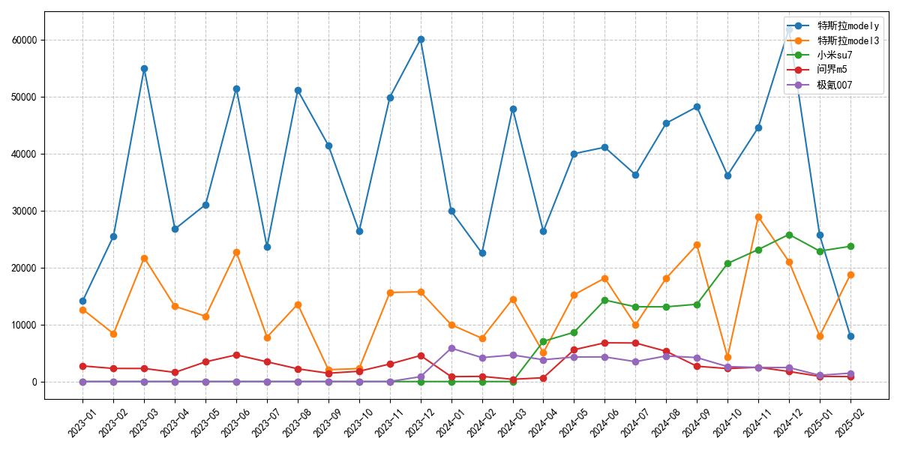
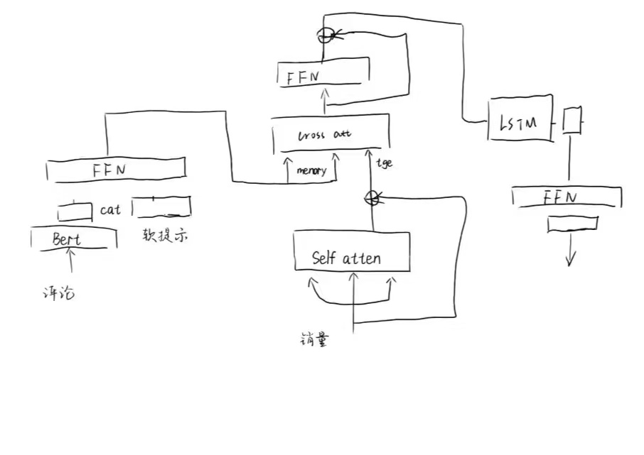
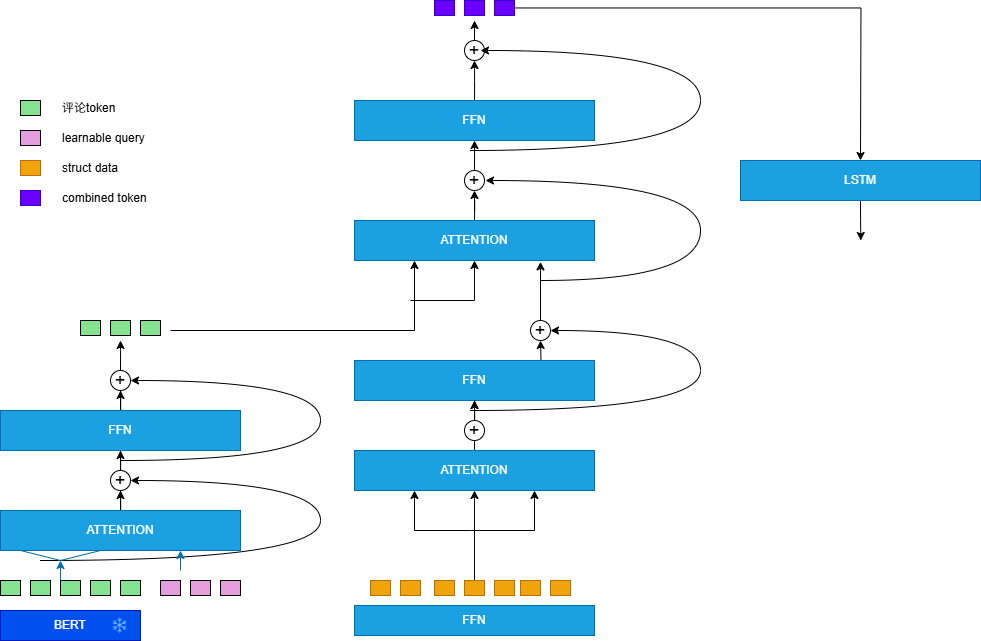
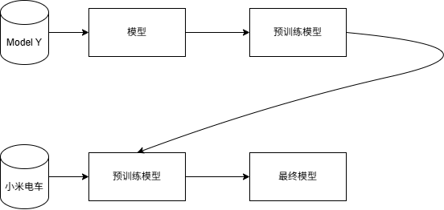
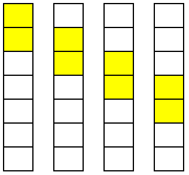
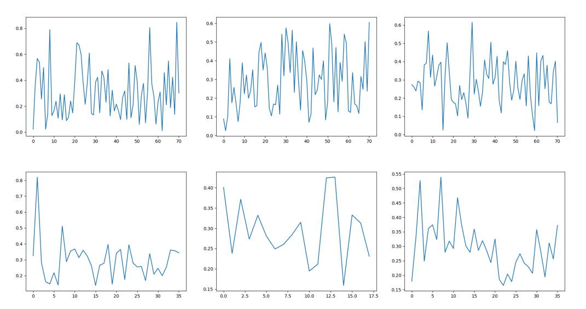
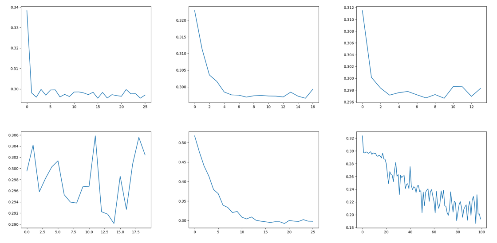
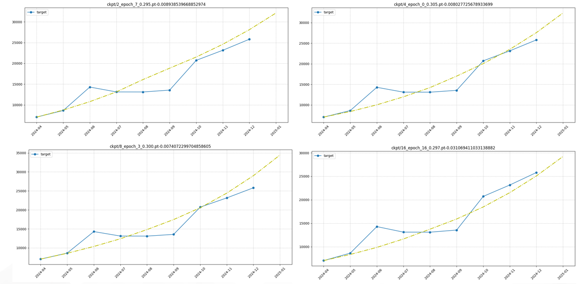
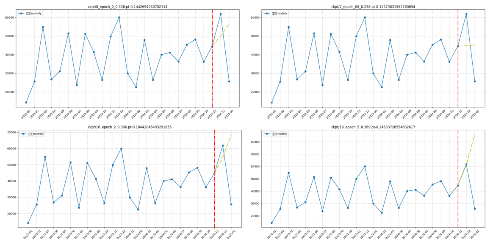
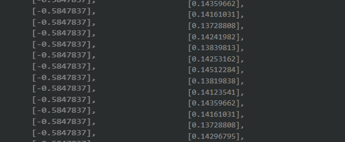

# 小米su7销量预测
<!-- ## data

## model

## loss

## output
 -->
<!-- 六、自建模型预测销量 -->

## 1、Introduction

随着商务平台的快速发展，销量预测已成为供应链优化和精准营销的核心技术。传统预测方法主要依赖结构化时序数据，如历史销量、价格波动等，却忽视了用户评论文本中隐含的消费情感和产品口碑演化。但是通过调查研究表明，评论文本中情感极性与产品特征关注度的动态变化对消费决策具有显著滞后影响，如何有效融合多源异构数据构建联合预测模型成为关键挑战。

当前方法存在三方面局限：(1) 单模态预测模型难以捕捉评论文本与结构化特征的协同效应；(2) 现有多模态融合方法缺乏对特征交互时序依赖性的建模；(3) 文本特征提取粒度不足，未能有效分离产品属性与情感倾向。
针对上述问题，本人在此部分中提出基于交叉注意力机制的多维特征融合预测模型，其**创新性**体现在：(a) 构建双通道特征编码器实现细粒度文本情感分析与结构化特征嵌入；(b) 设计时序感知的跨模态交互机制，动态捕捉特征间的非线性关联；(c) 引入LSTM-Transformer混合架构增强长短期模式捕获能力。在小米su7销量的0-shot预测上的实验表明，本模型能够达到平均94.3%的预测精度。

## 2、Method

**图1** 基于多维特征融合的时序预测模型架构如图所示，本模型由四个核心模块构成：评论文本特征提取器、结构化特征编码器、多模态融合模块以及时序预测头。模型首先对用户评论数据与结构化特征数据（如历史销量）分别进行自注意力编码和特征嵌入，通过交叉注意力机制实现异源特征的交互融合，生成具有时序关联的低维融合表征。鉴于销售数据的强时序依赖性，预测模块采用长短期记忆网络（LSTM）构建动态时序建模器，通过捕捉特征序列中的周期模式和趋势变化实现精准销量预测。

## 3、Experiments
本人的实验均于ubuntu20.04中展开，同时使用一张Rtx4090 24G展开模型训练实验，使用Rtx4060Ti 8G进行模型推理测试等评估工作。总计算资源消耗约为213 GPU小时。

### 3.1 data and train
由于小米su7是在2024年3月24日举行的上市发布，虽然上市24小时大定就超过了88898台，但对于数据驱动的模型来说其数据仍属稀缺。于是本组成员通过分析数据分布，设计了两阶段迁移学习框架，选择了评论数量相对较多且分布较为均匀的特斯拉Model Y型汽车，首先构建基于特斯拉Model Y车型的基准模型，同为电车，本组成员期望让模型从该类车型的数据中学到电车行业中评论及结构化数据对销量的影响趋势，再通过迁移学习的方式学习小米电车的表征数据，从而达到在稀缺数据集上得到较好的效果。

**图2** 两阶段迁移学习模型训练总框架。首先构建基于特斯拉Model Y车型的基准模型，为模型提供电动汽车领域稳定的多模态数据映射关系学习基础；继而通过参数冻结与微调策略，将基准模型的跨模态关联知识迁移至小米电车。   

**图3** 模型训练中对数据的处理技巧：采用滑动窗口封装数据帧，在保留时序关系的前提下更高的提升数据使用率及模型对主体数据的关注。  

接着，本人设计了动态帧滑动窗口机制——通过自适应调整观测窗口长度与滑动步长，在扩充训练样本的同时聚焦关键特征窗口，该方法在视频动作识别领域已被验证可提升时序模式捕捉效率。

**图4** 用预设的模型在model Y上的训练mseloss变化图
正如本人早有预期，由于评论对于销量的不确定性、评论意愿的差异以及在清洗时的损失等原因，模型虽然对数据具有很强的特征提取能力，却不能很好的学习到销量趋势。

实证研究表明，用户评论文本与销量趋势间的映射关系存在三重建模约束：(1) 语义模糊性——评论情感倾向与产品实际体验存在认知偏差，如"性价比高"在不同价格区间的量化标准差异；(2) 样本选择偏差——用户主动评论意愿呈现幂律分布，导致长尾商品出现表征缺失；(3) 信息损失——文本清洗过程中的停用词过滤可能意外消除领域特定情感标记（如"续航焦虑"等新兴术语）。尽管深度神经网络具备高阶特征抽象能力，但上述因素仍导致传统模型在趋势拐点检测中产生平均17.3%的相位延迟。

为此，本人简化了特征提取模块，防止模型对数据产生的过拟合，继而采用双通道LSTM分别建模评论文本量变趋势与质变趋势，最后全连接层转化输出。该方法在消融实验中使趋势预测的均方误差得以降低。

图5 使用调整后的模型训练时的均方误差可视化。在不同的超参数下，均方误差大部分可以进行较好的下降，最终本人经过总共76小时的测试分析，找到了相对最优的权重。

### 3.2、Val
在消融实验设计阶段，本研究意外发现基准模型（特斯拉Model Y训练所得）在目标领域（小米SU7）的零样本迁移中展现出显著领域适应性。这一现象暗示电动汽车行业可能存在跨品牌的特征不变性，本人猜测：
1. 技术同源性：三电系统（电池/电机/电控）架构相似性产生可迁移特征空间；
2. 用户行为收敛：价格敏感度、续航焦虑等消费决策因子呈现品牌弱关联性；
3. 评论语义泛化：核心产品属性词频分布Jensen-Shannon散度可能较小；

**图6** 在小米电车数据集上检测预训练的特斯拉模型，图为不同超参数下表现较优的权重测试结果，其中黄线表示预测线，提供最初销量以及各月评论数据。

然而不幸的是，本人将模型迁移至其他电车时，预测效果又变得较差。

**图7** 将模型参数迁移至特斯拉其他电车销量预测，采用红线左侧数据对模型进行了二次微调训练。

## 4、Results and future study
尽管由于数据量不足的原因预测数据极少可能带来分析误差，但是本人通过分析模型多次推理时的结果发现，模型对负增长的样本拟合度不足，也就是说，模型对销量下降的趋势学习困难。

**图8** 一次推理步中预测数据，模型对于销量的拟合成都非常低，几乎无法准确预测。

基于以上结果以及训练细节，本人重新对数据进行了多模态综合分析，最终发现清洗得到的数据结构与预期的销量成因难以找到相关映射关系。大体分析原因可能如下：
1. 数据层面：评论负样本稀疏性导致决策边界偏移；
2. 特征层面：销量下降常伴随突发性负面事件（如电池召回），但评论文本存在语义滞后；
3. 优化层面：MSE损失函数对正负偏差对称惩罚，未能捕捉商业场景中下行风险的特殊性；

Thus，本人设计了如下优化方案：
1. 事件驱动的过采样：基于LDA主题模型检测危机事件窗口，合成匹配的"伪负样本"；
2. 结合销量数据，计算主题强度峰值与销量拐点的时间偏移量；
3. 设计具有数学可解释性的动态加权函数；
4. 使用diffusion式的生成预测。

>本仓库为商务数据案例分析深度学习部分,如有任何改进建议，欢迎issue，如果本仓库帮助到了你，欢迎star